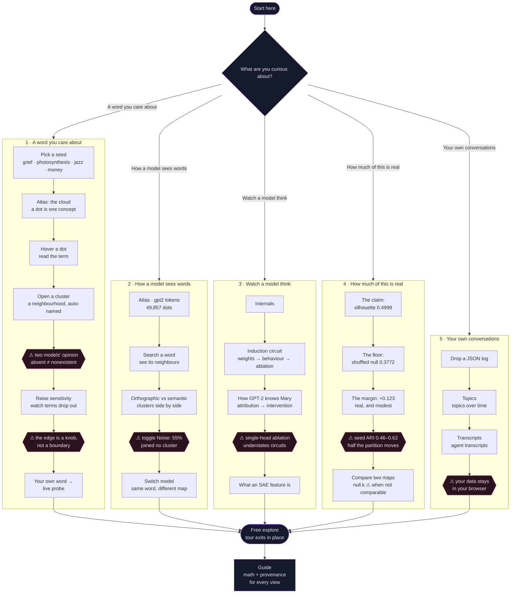

# Onboarding — historical "Start here" design

> **Status (2026-08-13): superseded at the product boundary.** The branded
> PsychiX shell now owns discovery and entry at `/psychiX/`; Nebul.AI remains
> the focused analytical instrument at `/psychiX/nebulai-maps/`. Do not add the
> start page described below to Nebul.AI unless that product decision changes.
> The interaction and honesty notes remain useful design research, but the
> proposed build order is no longer an implementation backlog.

This proposal began when Nebul.AI opened directly on 49,857 GPT-2 token dots,
208 clusters, and a gear panel, with no product-level introduction. It records
the earlier design for an onboarding path inside the instrument.

Two facts shape the whole design:

- **`nebulai probe` is the door for non-researchers.** It is the only front-end
  where a person types a word they care about instead of picking a model
  checkpoint. Everything else assumes prior interest in a specific model.
- **The honesty guardrails are the product, not a disclaimer.** A map that
  hides its 55% noise and its 0.5 seed-ARI is a prettier lie. The onboarding
  teaches each caveat *at the interaction where it bites*, never as a wall of
  text on entry.

## Shape

**One fork, five doors.** Each door is labelled by a *domain of interest* and
subtitled by the *question it answers* — so the two candidate axes collapse into
one level instead of nesting. The two-level version (domain → question) is a
pure refinement later: each door grows a sub-fork without the top level moving.

Doors live on a new `start` page in the top nav. Picking one runs a **scripted
tour** that drives the real app through ordinary store actions — the mechanism
already proven in `chrome/tours.ts` — so every step is a permalinkable state and
quitting a tour leaves you exactly where the last step put you.

| # | Door | Question | Lands in | Data |
|---|---|---|---|---|
| 1 | A word you care about | *What sits near an idea?* | Atlas | pre-baked probe clouds + live probe |
| 2 | How a model sees words | *What does a language model group together?* | Atlas + search | `gpt2` tokens (shipped) |
| 3 | Watch a model think | *Can we actually see a mechanism?* | Internals | gpt2 interp bundles (shipped) |
| 4 | How much of this is real | *Artifact or finding?* | Compare + metrics | `validation.json` (shipped) |
| 5 | Your own conversations | *What's in my data?* | Snapshot / Sessions | user-supplied |

Doors 1 and 5 need no model knowledge at all. Doors 3 and 4 are where the
existing researcher content plugs in unchanged — `tours.ts`'s induction, IOI and
SAE tours become door 3's three sub-steps verbatim.

## The tree

## Honesty, wired to interactions

Each caveat fires from a specific user action, not from a splash screen. This
is the whole difference between a guardrail and a disclaimer.

| Interaction | Caveat surfaced | Source of the number |
|---|---|---|
| Open any probe cloud | "Two models' joint opinion — the generator proposed these terms, the embedder placed them. A term that is absent means the generator didn't propose it." | `meta.generator`, `meta.embed_model` |
| Raise `--sensitivity` / see drop rate | "The map's edge is a knob. `n_dropped` of `n_proposed` terms were cut for sitting too far from the seed." | `meta.n_proposed`, `meta.kept`, `meta.n_dropped` |
| Toggle **Noise** on a token map | "55% of these points joined no cluster. HDBSCAN abstained; it did not decide they're meaningless." | `meta.noise_fraction` |
| Linger on a cluster boundary | "Seed ARI is 0.46–0.62. Re-run with a different seed and roughly half this partition redraws. The gross layout is stable; this boundary is not." | `validation.json` |
| Reach the ablation step | "Knock out L7H10 alone: Δ −0.014. Zero all four induction heads: Δ +2.04 — 2.8× the sum. Redundancy is why single-head ablations understate circuits." | gpt2 interp bundle |
| Open Compare | "Silhouette rises as a partition coarsens. When the null resolved a cluster count outside 0.5–2× the map's, the margin is flagged `?` and is not evidence." | `metrics` `null.k` |
| Anywhere | "This is clustering + visualization over public micro-models. It shows how units relate geometrically — not what any unit *does* to behaviour." | project guardrail |

## Resolution ledger

The implementation prerequisites from the original proposal are resolved:

| Item | Current state |
|---|---|
| Exported endpoint metadata | Resolved 2026-08-13. Both exporters stamp `public_embed_host()` rather than the raw `--embed-host`: loopback endpoints pass through verbatim (they name no machine but the reader's own) and every other endpoint collapses to `"remote"`. Existing deployed artifacts were sanitized without changing their map payloads. |
| Live probe build path | Resolved. `build_server` accepts `source=probe`, validates the free-text seed separately from `_MODEL_ID`, builds argv as a list without a shell, and maps the result to the same dataset slug as the CLI. |
| Pre-baked examples | Resolved. The deployed catalog contains three probe clouds: glassblowing, grief, and tidal ecology. |
| Product entry | Superseded. The external PsychiX shell owns first-run entry into Nebul.AI. Seer remains reachable through Nebul.AI's cross-instrument navigation. |
| In-instrument explanation | Retained. Nebul.AI's Guide documents all 25 live Internals views and their research references. |

Live probe generation remains optional and bring-your-own-endpoint. The static
deployment is complete without a generator or embedder running on the web
server, and the UI must continue to describe that absence honestly.

### What the `embed_host` fix cost — keep this record

`probe.py` and `api_tokens.py` both stamped the raw `--embed-host` into exported
`meta`, and those files are served publicly. This predated the onboarding work
and was a straight regression against the `a512c21 sanitize:` intent.

**The blast radius was larger than first recorded.** The original note named two
shipped datasets; a sweep of `nebulai-data/out` found **five**. The three it
missed are the `probe__*` clouds, and they carry `:11435` — the *current* port —
so they were baked *after* that warning was written.

`public_embed_host()` in `backend/embed.py` is deliberately *not* a general "is
this address private" classifier. That call fails open, and one wrong verdict
publishes the address; only loopback, which needs no judgement, survives, and
anything unparseable is treated as remote. The evidential fields (`embed_model`,
`embed_api`) are untouched: the host was never what made a map's vectors what
they are.

The five shipped artifacts were **redacted in place, not re-exported**. A
re-export re-runs the embedder, and the GGUF build is not bit-deterministic
(measured against the July cache: ~1e-3 elementwise, cosine >= 0.999945), so
every coordinate in five maps would have moved to fix one metadata string. The
substitution was verified to leave each parsed document differing at exactly one
key. Originals are in `nebulai-data/.pre-redaction-backup/` — outside the served
`out/` tree, deliberately.

## Archived ideas, not current Nebul.AI scope

- A two-level domain → question tree inside Nebul.AI.
- Rewriting the existing Internals tours around the proposed doors.
- A new `start` page, Atlas tour engine, or duplicate product-level caveat
  system inside the sealed analytical instrument.
